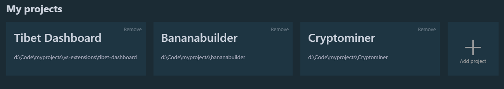

# Tibet-Dashboard 

Tibet-Dashboard is a VS Code extension creating a dashboard for your projects in VS Code.

## Usage
Open the dashboard by  ***CTRL + SHIFT + P*** and running the 'Open Dashboard' command.